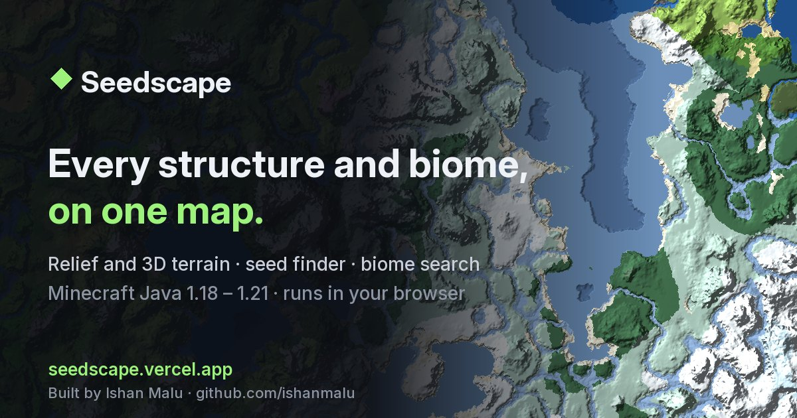

# Seedscape

A Minecraft seed explorer that puts everything on one map: biomes,
structures, strongholds and spawn, with shaded relief, a 3D terrain view, a
seed finder and biome search. Everything runs in your browser. There's no
server, no account and no ads.

**Live:** https://seedscape.vercel.app



## Features

### The map
- **Every layer on one map.** Biomes plus 23 structure and feature types:
  villages, desert pyramids, jungle temples, swamp huts, igloos, pillager
  outposts, ocean monuments, woodland mansions, ancient cities, trial
  chambers, trail ruins, ocean ruins, shipwrecks, ruined portals, buried
  treasure, mineshafts, desert wells, amethyst geodes, Nether fortresses,
  bastion remnants, End cities, End gateways and small End islands. Also
  world spawn, all 128 strongholds, slime chunks and a chunk/region grid.
  Each one can be switched on or off.
- **Three views.** A flat biome map, **Relief** (hill shading, water depth,
  contour lines) and **3D**.
- **Biomes at any height.** Switch from the surface to an underground slice,
  e.g. y −40 to find the deep dark and lush caves.
- **Two palettes.** The classic cubiomes colours, or a muted *Natural*
  palette that reads like an atlas.
- **Legend.** Lists the biomes in view with their share of the screen. Click
  one to jump to the nearest patch.
- **Structure density heatmap.** Shows where structures cluster.
- **Structure details.** Click any structure to see:
  - village type (plains, desert, savanna, taiga, snowy) and zombie villages;
  - bastion type (housing units, hoglin stables, treasure room, bridge);
  - igloo basements and ruined portal variants;
  - End cities with ships (elytra), also marked on the map;
  - Nether fortress layouts, drawn piece by piece when zoomed in.

  From the popover you can copy a `/tp` command, drop a pin, or open the
  spot in 3D.
- **Nearby list.** The closest structure of each kind to the centre of the view.

### 3D terrain
- A blocky diorama of 800, 1,600 or 3,200 blocks square, with cliffs, snow
  on peaks, sea floors and see-through water. It's built in a worker and
  only draws visible faces, so it stays fast.
- X/Z labels on the edges, a north marker, and a live **X · Y · Z · biome**
  readout under the cursor.
- Structure pins and your waypoints float above the terrain.
- Double-click to drop a pin. The arrow keys move the area.

### Seed finder
- Search for seeds where your conditions hold within a set distance of
  **0, 0 or the world spawn**. Up to six conditions:
  - **Structure:** at least *N* within range, optionally all within *X*
    blocks of each other (e.g. three witch huts close together);
  - **Biome:** present within range, optionally covering at least *P* % of
    the area;
  - **Spawn in biome.**
- Runs on every CPU core but one. The cheap checks (structure positions
  come from the seed alone) run first, and biome checks only run on seeds
  that pass them.
- Results stream in live; click one to open it. It shows seeds per second,
  how rare a match is ("≈ 1 in 8 seeds") and roughly how often a new one
  turns up.

### Tools
- **Biome search:** the nearest cherry grove, mushroom fields, ice spikes,
  and so on, from the dropdown, the legend or ⌘K.
- **Distance ruler,** which also shows the matching Nether (or Overworld)
  distance.
- **Nether portal link helper:** click your portal and it pins the matching
  spot in the other dimension (×8 / ÷8).
- **Command palette (⌘K / Ctrl+K):** go to coordinates, open a seed, find
  biomes and structures, toggle layers, switch views, export.
- **Waypoints:** pin by typing X/Z, right-clicking the map or
  double-clicking in 3D. Rename or delete them, and import or export as
  Seedscape JSON or Xaero's Minimap files.

### Sharing
- **Saved seeds:** press ☆ next to the seed to save it with its exact view,
  then click the seed box to reopen, rename or remove saved seeds (also in
  ⌘K). They're kept in your browser; no account needed.
- **Start screen:** opening the site without a link asks for your seed
  (paste it, pick a version, Explore), with one-click *Continue* for your
  last seed, your saved seeds, or a random seed. Shared links skip it.
- **Links hold everything:** seed, version, dimension, view, position, zoom,
  layers, biome height, palette, 3D size and pins.
- **Save PNG** of the current view, or a **4K poster**, with a caption.
- **Embed** the map on another site with an `<iframe>`; Share → Copy embed
  code.
- **Compare two seeds** side by side. Pan either map and the other follows.

### Platform
- **Java** 1.18 – 1.21.4 in the Overworld, Nether and End. **Bedrock**
  shows biomes and terrain only (see Accuracy).
- **Works offline** after the first visit. Generated tiles are cached in
  your browser, so going back to a seed is instant.
- **Works on phones**, with keyboard and screen-reader support.

## Keyboard and mouse

| Action | How |
|---|---|
| Pan / zoom | Drag, scroll or pinch; arrow keys (Shift for bigger steps); `+` / `-` |
| Command palette | ⌘K / Ctrl+K |
| Ruler / portal link | `R` / `P`, then click; `Esc` to stop |
| Structure details | Click a marker |
| Drop a pin | Right-click the map, or double-click in 3D |
| Move the 3D area | Arrow keys (in 3D) |

## Accuracy

- **Source:** structure positions and biomes come from
  [cubiomes](https://github.com/Cubitect/cubiomes), which reimplements
  Minecraft's world generation.
- **Approximate structures:** on 1.18+, desert pyramids, jungle temples and
  mansions use an approximate terrain check, marked *approx.* in the
  layers list.
- **3D terrain:** an estimate of the surface height. It has no trees, caves
  or buildings.
- **Finder distances from spawn:** these use an estimate of the spawn
  point, so they can be off by a little.
- **Bedrock:** for the same seed Bedrock has the same biomes as Java, but
  it places structures, spawn and slime chunks differently. The Bedrock
  option therefore shows biomes and terrain only.
- **Versions:** newer Minecraft versions are added once cubiomes supports
  them.

## Privacy

- **Local:** everything runs locally in your browser. Generated tiles,
  saved seeds and your last view stay on your device.
- **Analytics:** page views are counted with Vercel Web Analytics, which
  uses no cookies, and only on the live site.
- **No third-party requests:** fonts and libraries are served by the site
  itself.

## Development

The site is static files in `public/`, with no build step for the web code.
Only the WebAssembly needs compiling, and the compiled files are committed.

```sh
npx serve public                 # run locally on http://localhost:3000
./build.sh                       # rebuild the WebAssembly (brew install emscripten)
node --test tests/*.test.mjs     # tests; CI runs them on every push
```

Pushes to `main` deploy automatically to Vercel. `main` is protected against
force-pushes and deletion.

| Path | What it is |
|---|---|
| `wasm/api.c` | Every C function the site calls, compiled to `public/cubiomes.{mjs,wasm}` |
| `public/app.js` | Map, layers, details, waypoints, sharing, URL state |
| `public/worker.js` | Map tiles, structures and 3D meshes, in a pool of workers, with an IndexedDB cache |
| `public/finder.js`, `finder-ui.js` | Seed finder worker and panel |
| `public/view3d.js` | three.js 3D view (loaded only when opened) |
| `public/tools.js` | Ruler and portal link tools |
| `public/commands.js` | ⌘K command palette |
| `public/waypoints-io.js` | Pin import/export (JSON, Xaero) |
| `public/palette.js`, `seed.js`, `icons.js` | Colour palettes, seed parsing, original SVG icons |
| `public/saved.js` | Saved seeds and last view (localStorage) |
| `public/compare.html` | Side-by-side seed comparison |
| `public/sw.js` | Offline support |
| `scripts/og.*` | Regenerates the social preview image |
| `tests/` | Tests for the WebAssembly build and the pure modules |
| `AGENTS.md` | Notes and conventions for contributors |

## Credits

- [cubiomes](https://github.com/Cubitect/cubiomes) by Cubitect (MIT), vendored in `vendor/cubiomes`
- [three.js](https://threejs.org) r170 (MIT), vendored in `public/vendor/three`
- [Inter](https://rsms.me/inter/) and [JetBrains Mono](https://www.jetbrains.com/lp/mono/) (SIL OFL 1.1), in `public/fonts`
- Icons are original and drawn for Seedscape; no Mojang artwork is used.

Not an official Minecraft product. Not approved by or associated with Mojang
or Microsoft.

## Support

Seedscape is free and has no ads. If it helps you, you can
[buy me a coffee](https://buymeacoffee.com/ishanmalu).

Built by [Ishan Malu](https://github.com/ishanmalu).

## License

MIT, see [LICENSE](LICENSE).
